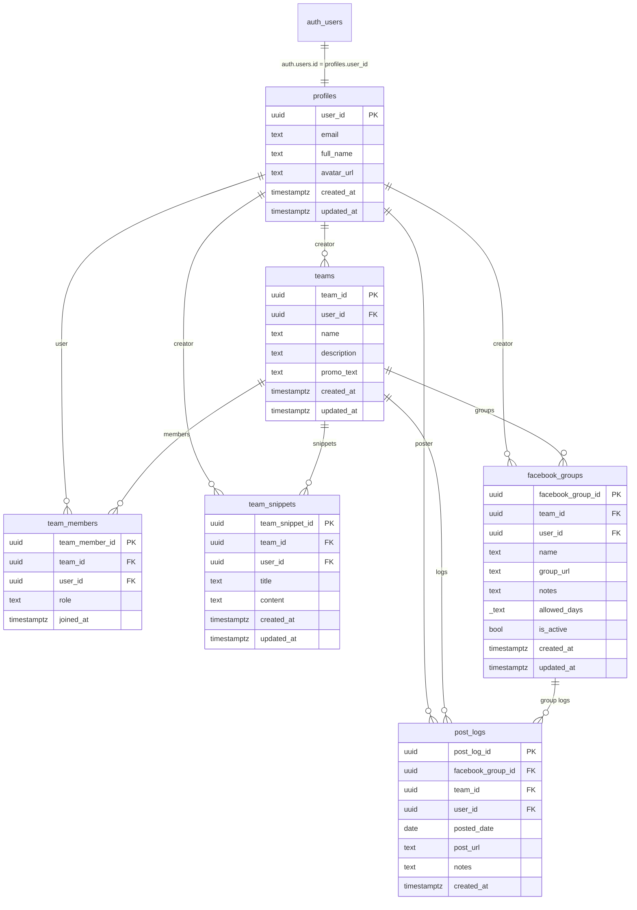

# Promotify One - Project Context & Guidelines

## Overview
Promotify One is a team-collaborative social media promotion tracker built with React Router v7, Express.js, and Supabase (PostgreSQL + Auth). It allows marketing teams and organizers to coordinate Facebook group promotional postings, share snippets/promo copy, track posting schedules, and log daily posts.

---

## Tech Stack & Architecture

- **Monorepo**: npm workspaces (`frontend`, `backend`)
- **Frontend** (`frontend/`):
  - Framework: React Router v7 (SSR/Node) + React 19 + TypeScript
  - Styling: Vanilla CSS with custom properties / glassmorphism
  - Icons: `lucide-react`
  - Mobile Shell: Capacitor v6
- **Backend** (`backend/`):
  - Runtime & Framework: Node.js, Express 5, TypeScript (`tsx` runner)
  - Architecture: Layered architecture (`routes` -> `controllers` -> `services` -> `repositories`)
  - Validation: `zod`
- **Database & Auth**:
  - Supabase (PostgreSQL with Row-Level Security, Supabase Auth via JWT)

---

## Database Schema (PostgreSQL / Supabase)

### Entity-Relationship Diagram



### Table Specifications

#### 1. `profiles`
User profiles synced with Supabase Auth (`auth.users`).
| Column | Type | Constraints / Defaults | Description |
|---|---|---|---|
| `user_id` | `uuid` | Primary Key, FK -> `auth.users(id)` | User auth identifier |
| `email` | `text` | NOT NULL | User email address |
| `full_name` | `text` | NOT NULL | Full name of user |
| `avatar_url` | `text` | Nullable | Optional profile avatar image URL |
| `created_at` | `timestamptz` | NOT NULL, Default `now()` | Record creation timestamp |
| `updated_at` | `timestamptz` | NOT NULL, Default `now()` | Record update timestamp |

#### 2. `teams`
Workspaces containing shared groups, snippets, and members.
| Column | Type | Constraints / Defaults | Description |
|---|---|---|---|
| `team_id` | `uuid` | Primary Key, Default `gen_random_uuid()` | Team identifier |
| `user_id` | `uuid` | Nullable, FK -> `profiles(user_id)` | Team creator / owner |
| `name` | `text` | NOT NULL | Team workspace name |
| `description` | `text` | Nullable | Workspace description |
| `promo_text` | `text` | Nullable | Workspace default promotional message |
| `created_at` | `timestamptz` | NOT NULL, Default `now()` | Record creation timestamp |
| `updated_at` | `timestamptz` | NOT NULL, Default `now()` | Record update timestamp |

#### 3. `team_members`
Association table connecting users to team workspaces with assigned roles.
| Column | Type | Constraints / Defaults | Description |
|---|---|---|---|
| `team_member_id` | `uuid` | Primary Key, Default `gen_random_uuid()` | Membership identifier |
| `team_id` | `uuid` | NOT NULL, FK -> `teams(team_id)` ON DELETE CASCADE | Target team |
| `user_id` | `uuid` | NOT NULL, FK -> `profiles(user_id)` ON DELETE CASCADE | Associated user |
| `role` | `text` | NOT NULL ('owner', 'admin', 'member') | Role within the workspace |
| `joined_at` | `timestamptz` | NOT NULL, Default `now()` | When user joined the team |

#### 4. `team_snippets`
Reusable copy snippets shared within a workspace.
| Column | Type | Constraints / Defaults | Description |
|---|---|---|---|
| `team_snippet_id` | `uuid` | Primary Key, Default `gen_random_uuid()` | Snippet identifier |
| `team_id` | `uuid` | NOT NULL, FK -> `teams(team_id)` ON DELETE CASCADE | Target team |
| `user_id` | `uuid` | Nullable, FK -> `profiles(user_id)` | Author of snippet |
| `title` | `text` | NOT NULL | Snippet title / label |
| `content` | `text` | NOT NULL | Promotional body content |
| `created_at` | `timestamptz` | NOT NULL, Default `now()` | Creation timestamp |
| `updated_at` | `timestamptz` | NOT NULL, Default `now()` | Update timestamp |

#### 5. `facebook_groups`
Tracked promotion destinations belonging to a team workspace.
| Column | Type | Constraints / Defaults | Description |
|---|---|---|---|
| `facebook_group_id` | `uuid` | Primary Key, Default `gen_random_uuid()` | Group identifier |
| `team_id` | `uuid` | NOT NULL, FK -> `teams(team_id)` ON DELETE CASCADE | Owning team |
| `user_id` | `uuid` | Nullable, FK -> `profiles(user_id)` | User who added the group |
| `name` | `text` | NOT NULL | Facebook group title |
| `group_url` | `text` | NOT NULL | Link to Facebook group |
| `notes` | `text` | Nullable | Posting rules, limits, or admin instructions |
| `allowed_days` | `text[]` (`_text`) | NOT NULL, Default `'{}'::text[]` | Days allowed (Sunday-Saturday) |
| `is_active` | `bool` | NOT NULL, Default `true` | Active status toggle |
| `created_at` | `timestamptz` | NOT NULL, Default `now()` | Creation timestamp |
| `updated_at` | `timestamptz` | NOT NULL, Default `now()` | Update timestamp |

#### 6. `post_logs`
Historical log entries created when a team member marks a group as posted.
| Column | Type | Constraints / Defaults | Description |
|---|---|---|---|
| `post_log_id` | `uuid` | Primary Key, Default `gen_random_uuid()` | Log entry identifier |
| `facebook_group_id` | `uuid` | NOT NULL, FK -> `facebook_groups(facebook_group_id)` ON DELETE CASCADE | Posted group |
| `team_id` | `uuid` | NOT NULL, FK -> `teams(team_id)` ON DELETE CASCADE | Workspace context |
| `user_id` | `uuid` | Nullable, FK -> `profiles(user_id)` | Member who executed the post |
| `posted_date` | `date` | NOT NULL | Date of posting |
| `post_url` | `text` | Nullable | Optional link to live post |
| `notes` | `text` | Nullable | Optional log notes |
| `created_at` | `timestamptz` | NOT NULL, Default `now()` | Creation timestamp |

---

## Directory Structure

```
promotify/
├── backend/
│   ├── src/
│   │   ├── config/           # Supabase client & environment configuration
│   │   ├── controllers/      # Express controllers (team, group, post)
│   │   ├── middleware/       # JWT auth verification (requireAuth)
│   │   ├── repositories/     # Data layer querying Supabase tables directly
│   │   ├── routes/           # REST endpoints (/api/teams, /api/groups, /api/posts)
│   │   ├── services/         # Business logic, permissions, role authorization
│   │   ├── types/            # TypeScript domain interfaces
│   │   └── index.ts          # Express application entry point
│   ├── package.json
│   └── tsconfig.json
├── frontend/
│   ├── app/
│   │   ├── components/       # UI elements (modals, drawers, layout)
│   │   ├── context/          # AuthContext & session state
│   │   ├── lib/              # API fetch client and Supabase browser client
│   │   ├── routes/           # React Router v7 routes
│   │   └── types/            # Frontend interfaces
│   ├── package.json
│   └── tsconfig.json
├── GEMINI.md                 # Agent context & schema documentation
├── package.json              # Monorepo workspaces definition
└── README.md
```

---

## Essential Commands

```bash
# Install all dependencies across workspaces
npm install

# Run backend and frontend concurrently
npm run dev

# Run individual workspaces
npm run dev:backend
npm run dev:frontend

# Typecheck both projects
npm run typecheck

# Build frontend for production
npm run build
```

